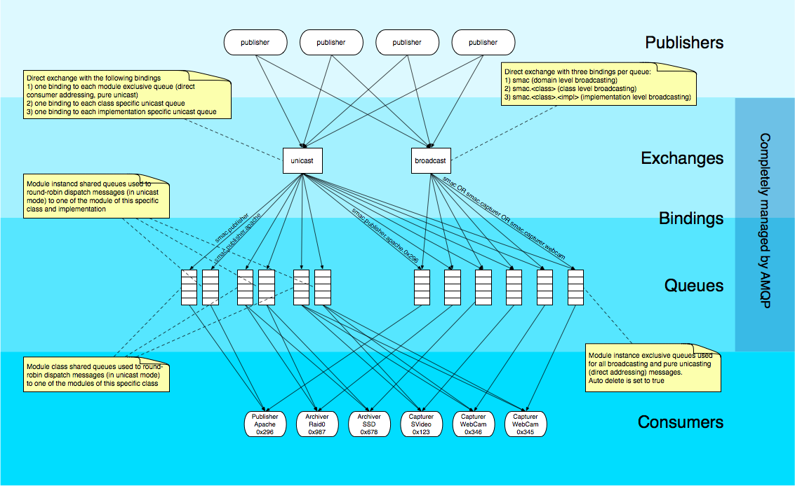

AMPQ Topology
=============

An AMQP system has 5 main actors:

* Publishers: standalone systems which publish messages to an exchange;
* Exchanges: message receivers which route the message to the correct
  queue/queues based on a binding;
* Bindings: set of rules to connect a queue to an exchange;
* Queue: message buckets which dispatch the message to the subscribed
  consumers;
* Consumers: end-systems which receive messages from the queue in order
  to process they.
  
@TODO

The following image represents the low-level AMQP topology which offers
the required flexibility to combine message distribution modes with module
targeting levels in every reasonable way with the limitations given by the
upper layers of the :doc:`SMAC Stack </concepts/stack>`.

